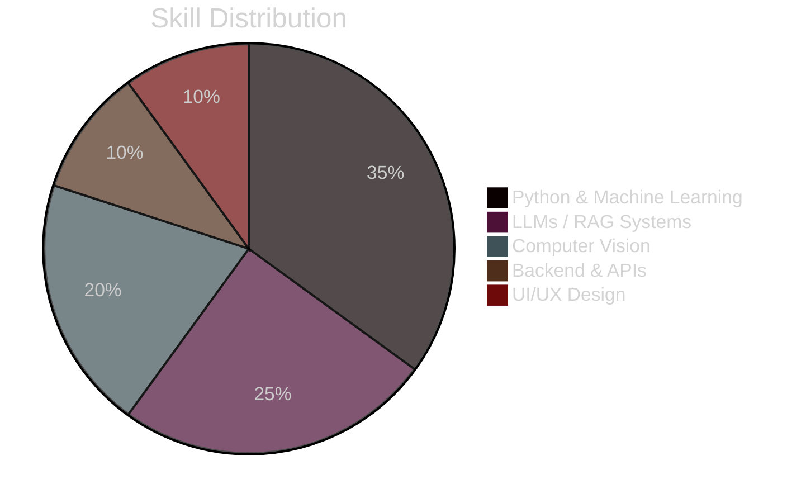

<!-- ====== Muhammad Humais Aslam ====== -->
<h1 align="center">
  
</h1>

  
  
  

---

## 🧠 About Me
🎓 **AI Graduate — Bahria University, Karachi**

I am an **AI Engineer** specializing in **LLMs, Retrieval-Augmented Generation (RAG), and Computer Vision**, with strong experience in **multimodal AI systems** and **production-ready deployments**.

I focus on **grounded, evaluation-driven AI** — reducing hallucinations, improving reliability, and designing systems that actually ship.

I also bring **UI/UX expertise**, enabling me to build AI products that are not only intelligent, but usable.

---

## 🔬 Tech DNA (always visible)

---

## 🛠️ Core Arsenal

| **Domain** | **Tools & Frameworks** |
|-----------|------------------------|
| **LLMs & RAG** | OpenAI • LangChain • RAG • FAISS • Chroma • Prompt Engineering |
| **Machine Learning** | Python • PyTorch • TensorFlow • Transformers |
| **Computer Vision** | YOLO • CNNs • Medical Imaging |
| **Backend** | FastAPI • Flask • SQLite • MongoDB |
| **Automation** | n8n • API Pipelines • Inference Optimization |
| **Design** | Figma • Adobe XD • UX Research • Design Systems |

---

## 🚀 Featured Projects

| Project | Stack | Impact |
|-------|------|--------|
| 🫁 **Pneumedlex (FYP)** | PyTorch, Transformers, MIMIC-IV | Multimodal pneumonia detection using clinical text + X-ray imaging to reduce false negatives |
| 🗣️ **Voice-Enabled AI Chatbot** | GPT-4, Whisper, Neural TTS | Full-duplex conversational AI with real-time speech interaction |
| 🛒 **Offline Desktop POS** | Electron, SQLite | Inventory & billing system with thermal receipt printing and offline-first reliability |

---

## 🧪 Research & Professional Experience

### 🏢 AI Research Intern — **Bahria Technologies**
- Engineered **RAG pipelines** to reduce hallucinations in domain-specific LLMs  
- Analyzed **context window mechanics**, chunking strategies, and retrieval relevance  
- Improved answer grounding via retrieval-first inference architectures  

### 🤖 Junior AI Developer — **Olive Digital**
- Deployed **NLP and Computer Vision models** in production environments  
- Optimized inference pipelines for latency and scalability  
- Integrated AI models into backend APIs  

### 🎨 Senior UI/UX Designer — **Tech Brio Pvt Ltd**
- Led end-to-end **product design** for SaaS and E-commerce platforms  
- Delivered pixel-perfect **Figma → developer handoff systems**  
- Worked with international clients on usability and conversion optimization  

---

## 📈 Skill Snapshot

---

## 📊 GitHub Stats

## 🎯 Currently Exploring
- Self-correcting **RAG pipelines**
- Multimodal medical AI (text + imaging)
- LLM evaluation, grounding, and hallucination mitigation

---

## ⚡ Beyond Code
🏆 Competitive **CS2 Tournament Player** (PROCOM, Evolve 24)  
🏋️ Fitness-driven, discipline-focused mindset  

---

## 📬 Let’s Build Something

---

⭐ **Research-driven. Production-ready. Design-aware.**
